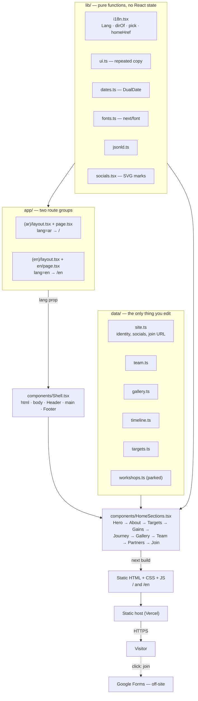

# AIChE-KKU

The website of the AIChE student chapter at King Khalid University, Abha —
fully bilingual, Arabic and English rendered as two separate static trees
rather than one page that swaps strings at runtime.

<!-- LIVE SITE: replace with the production URL once the domain is live -->
<!-- SCREENSHOT 1 (Arabic home, /):   -->
<!-- SCREENSHOT 2 (English home, /en):   -->

## Overview

The American Institute of Chemical Engineers chartered a student chapter at
King Khalid University in July 2021. The chapter had no web presence: no way to
show a prospective member what it does, no indexable page an employer or a
partner could find, and no single place its own material lived.

This is that page. It presents the chapter — who it is, what a member gains,
what it has done, who runs it, who partners with it — and funnels every visitor
toward one action: the join form.

Two constraints shaped the whole build.

**It has to be genuinely bilingual, not translated.** Arabic is the primary
language and owns `/`; English lives at `/en`. Each is a real, separately
generated URL, so `<html lang>` and `<html dir>` are already correct in the
served HTML. There is no flash of the wrong writing direction on first paint,
and a search engine can index both.

**It has to be maintainable by a student.** All content is typed TypeScript
under `data/`. Adding a team member, a photograph or a milestone means editing
one array — no CMS, no database, no admin panel, no deploy pipeline to learn.

## Features

- **Two independently rendered language trees**, `/` (Arabic, RTL) and `/en`
  (English, LTR), sharing one component tree.
- **Dual Hijri/Gregorian dates** everywhere a date appears, with the numerals
  bidi-isolated so a right-to-left page cannot reverse them.
- **A pinned "what you gain" section** on desktop, which becomes a swipeable
  card rail on phones — same content, same progress vocabulary, different
  gesture.
- **An animated chemistry background** (benzene rings, gears, charged bonds,
  Bohr atoms) authored twice, once for landscape screens and once for portrait.
- **Pointer-reactive motion** — hero parallax, card tilt, gallery drift, button
  magnetism — all driven by a single `requestAnimationFrame` loop.
- **Counting figures**, a sticky-scroll about section, a milestone timeline, a
  curated photo grid, team cards with hover/tap biographies, and a partners
  strip.
- **SEO and sharing built in**: per-language metadata, `hreflang` alternates, a
  hand-written sitemap, `robots.txt`, JSON-LD structured data and pre-rendered
  Open Graph images.
- **Reduced-motion support that is complete, not partial** — every masked or
  drawn element is handed its finished state, so nothing stays invisible when
  animation is suppressed.

## Tech Stack

| Layer | Choice | Notes |
| --- | --- | --- |
| Framework | **Next.js 15.5** (App Router) | Static generation; no server runtime needed |
| UI | **React 19** | Server Components by default; `'use client'` only where motion needs it |
| Language | **TypeScript 5.5**, `strict: true` | Content in `data/` is typed, so a malformed entry fails the build |
| Styling | **Handwritten CSS** in `app/globals.css` | Tailwind is installed for its Preflight reset only — see below |
| Animation | **GSAP 3.12** + ScrollTrigger | Dynamically imported by the one section that uses it |
| Fonts | **next/font** | Space Grotesk + IBM Plex Sans Arabic, self-hosted at build time |
| Build | PostCSS + Autoprefixer | |
| Hosting | Vercel (or any static host) | No backend, no database, no environment variables |

**Why Tailwind is a dependency when no utility class is used.** `globals.css`
opens with `@tailwind base`, which injects Preflight. The handwritten CSS is
authored on top of that reset — border-box sizing, zeroed margins, `display:
block` on images, font inheritance into buttons — rather than duplicating it.
`@tailwind components` and `@tailwind utilities` currently emit nothing.
`tailwind.config.ts` mirrors the design tokens as documentation; `globals.css`
owns the runtime values. Removing the package without first writing a
replacement reset will shift the layout in places that are easy to miss.

## Architecture

There is no backend. Content is TypeScript, rendered to HTML at build time, and
served as static files.



Three architectural decisions carry the design.

**Two route groups instead of one `[lang]` segment.** A single dynamic segment
would mean deciding the language inside the render, leaving `<html lang>` and
`<html dir>` to be corrected after first paint — an RTL page visibly flipping
direction as it loads. `app/(ar)` and `app/(en)` each own a root layout that
hands `Shell` a fixed `lang`, so direction is correct in the served bytes and
each language is a real indexable URL. The cost is that both layouts duplicate
their metadata block; that is the trade, and it is a deliberate one.

**Language is a prop, never context.** `lib/i18n.tsx` is plain functions with no
React state, so Server and Client Components can both import it. Adding
`'use client'` there would make `pick()` unusable from the server components
that render most of the page.

**The GAINS section is pinned with `position: sticky`, not GSAP's pin.** GSAP's
pin injects measured heights into the layout, and any viewport resize while
pinned makes the section slip. Sticky lets the browser recompute for itself;
ScrollTrigger is left with one job — reading scroll progress — which cannot
desync anything. If GSAP fails to load, the viewport is narrow, or reduced
motion is requested, the section degrades to a plain list with identical
content.

## Project Structure

```
aiche-kku/
├── app/
│   ├── (ar)/                  Arabic tree, served at /
│   │   ├── layout.tsx           root layout: metadata, <Shell lang="ar">
│   │   ├── page.tsx             <HomeSections lang="ar" />
│   │   ├── opengraph-image.png  1200x630 share image (generated)
│   │   └── opengraph-image.alt.txt
│   ├── (en)/                  English tree, served at /en
│   │   ├── layout.tsx
│   │   ├── en/page.tsx
│   │   ├── opengraph-image.png
│   │   └── opengraph-image.alt.txt
│   ├── globals.css            design tokens + every bespoke style (~1.3k lines)
│   ├── icon.png               favicon
│   ├── apple-icon.png
│   ├── robots.ts              generates /robots.txt
│   └── sitemap.ts             generates /sitemap.xml
│
├── components/                one file per section, plus shared pieces
│   ├── Shell.tsx              <html>/<body>, skip link, sprites, Header, Footer
│   ├── HomeSections.tsx       section order for both languages
│   ├── Header.tsx             nav, scroll-spy, language switch          [client]
│   ├── Hero.tsx               masked word-by-word headline
│   ├── About.tsx              sticky summary + four scrolling beats
│   ├── Targets.tsx            the five figures
│   ├── Gains.tsx              pinned stage / phone rail                 [client]
│   ├── Journey.tsx            milestone timeline
│   ├── Gallery.tsx            curated photo grid
│   ├── Team.tsx               supervisor, leadership, committee heads   [client]
│   ├── Partners.tsx           partner logos and accounts
│   ├── Join.tsx               the closing call to action
│   ├── Programme.tsx          workshops — PARKED, not rendered          [client]
│   ├── Footer.tsx
│   ├── ChemField.tsx          animated chemistry background + <defs>
│   ├── PointerMotion.tsx      the single rAF motion loop + useMagnet    [client]
│   ├── Reveal.tsx             shared-observer entrance animation        [client]
│   ├── CountUp.tsx            figures that count up once, in view       [client]
│   ├── DualDate.tsx           Hijri + Gregorian rendering
│   ├── Num.tsx                bidi isolation for numerals
│   ├── SwapLabel.tsx          label that swaps on hover
│   ├── JoinButton.tsx         the one join CTA                          [client]
│   ├── Socials.tsx            the chapter's own channels
│   └── Icon.tsx               chemistry icon sprite
│
├── data/                      ALL CONTENT — this is what you edit
│   ├── site.ts                identity, siteUrl, social links, join URL
│   ├── team.ts                supervisor, leadership, committees
│   ├── gallery.ts             curated photos
│   ├── timeline.ts            milestones
│   ├── targets.ts             the numbers (read the note at the top)
│   └── workshops.ts           workshops (section parked)
│
├── lib/
│   ├── i18n.tsx               Lang, dirOf, otherLang, homeHref, pick
│   ├── ui.ts                  every repeated interface string + NAV_ORDER
│   ├── dates.ts               DualDate type + dualText flat form
│   ├── fonts.ts               next/font setup, fontVars
│   ├── jsonld.ts              schema.org EducationalOrganization
│   └── socials.tsx            SocialKey, labels and SVG path data
│
├── public/
│   ├── logo/                  logo-mark.png, logo-full.png
│   ├── team/                  member portraits
│   ├── gallery/               g1–g9.jpg
│   └── partners/              partner logos
│
├── scripts/
│   └── og-image.mjs           regenerates both Open Graph images
│
├── next.config.mjs            images, security headers, static-export switch
├── tailwind.config.ts         Preflight + the token mirror
├── tsconfig.json
├── SECURITY.md
└── LICENSE                    MIT — code only
```

## How It Works

1. **`next build` renders both trees.** There is no request-time rendering; the
   output is HTML.
2. **A route group picks the language.** `app/(ar)/layout.tsx` and
   `app/(en)/layout.tsx` are separate root layouts. Each declares its own
   metadata (title, description, canonical, `hreflang` alternates, Open Graph,
   Twitter card, Search Console verification) and renders
   `<Shell lang="…" jsonLd={organizationJsonLd(lang)}>`.
3. **`Shell` builds the document.** It sets `<html lang>` and `<html dir>` from
   `dirOf(lang)`, applies the font CSS variables, emits the JSON-LD script, and
   lays out the skip link, the SVG sprites (`IconSprite`, `ChemDefs`),
   `Header`, `<main>`, `Footer` and the headless `PointerMotion`.
4. **`HomeSections` renders the page in one fixed order**: Hero → About →
   Targets → Gains → Journey → Gallery → Team → Partners → Join. The order is
   an argument, documented in that file: who we are → why us → what *you* gain
   → the proof → the people → who stands with us → how you join.
5. **Each section imports its own data and picks its language strings.**
   `pick(lang, ar, en)` from `lib/i18n.tsx` is the single mechanism. There is no
   translation file and no runtime lookup — the right string is baked into each
   tree at build time.
6. **Motion starts after hydration.** `PointerMotion` opens one
   `requestAnimationFrame` loop for everything that follows the pointer
   globally, and per-element listeners for everything that needs
   element-relative coordinates. `Reveal` shares a single
   `IntersectionObserver` across every entering element on the page. `Gains`
   dynamically imports GSAP only on a wide, motion-permitting viewport.
7. **Every one of these degrades.** Reduced motion, a narrow viewport or a
   failed GSAP chunk each fall back to fully readable static content.

## Installation

Requires **Node.js 18.18+, 19.8+ or 20+** (see `engines` in `package.json`);
Node 20 or newer is recommended.

```bash
git clone https://github.com/Sabra7/AIChE-KKU.git
cd AIChE-KKU
npm install
npm run dev          # http://localhost:3000
```

That is the whole setup. **If anything ever asks you for a database URL or a
`.env` file, something has been added that should not have been.**

- Arabic is at [http://localhost:3000/](http://localhost:3000/)
- English is at [http://localhost:3000/en](http://localhost:3000/en)

## Environment Variables

**None. The project uses zero environment variables** — there is no `.env`, no
`.env.example`, and no `process.env` reference in `app/`, `components/`, `lib/`
or `data/`.

Everything that would normally be configuration is checked-in TypeScript:

| Value | Where it lives | What it does |
| --- | --- | --- |
| `siteUrl` | `data/site.ts` | Canonical origin. Feeds `metadataBase` in both root layouts, `sitemap.ts`, `robots.ts` and `lib/jsonld.ts`. **Changing this one line is the entire domain migration.** |
| `joinUrl` | `data/site.ts` | The Google Form the join button opens. Referenced in four places, defined once. |
| `socials` | `data/site.ts` | The chapter's own channels. Only list one that has a real URL. |
| `verification.google` | both `app/*/layout.tsx` | Google Search Console token. Public by design — it is published as a `<meta>` tag. Not a secret. |

The one build-time environment variable in the repository is `OG_FONT_DIR`,
which `scripts/og-image.mjs` sets for its own child process. You never set it
yourself.

## Running the Project

| Command | What it does |
| --- | --- |
| `npm run dev` | Development server with hot reload on `:3000` |
| `npm run build` | Production build; output in `.next/` (or `out/` in export mode) |
| `npm start` | Serves the production build — run `npm run build` first |
| `npm run typecheck` | `tsc --noEmit` across the whole project |
| `node scripts/og-image.mjs` | Regenerates both Open Graph share images |

**There is no linter, no formatter and no test suite in this repository.** No
ESLint config, no Prettier config, no test runner, and no `lint`, `format` or
`test` script — do not run those commands expecting them to work. `npm run
build` and `npm run typecheck` are the two gates that exist, and TypeScript's
`strict` mode is what catches a malformed content entry.

`node scripts/og-image.mjs` has requirements the app itself does not: a network
connection (it downloads the two fonts), **Node 22.6+** (it imports
`data/site.ts` directly and relies on Node's TypeScript type stripping), and
`sharp` — which normally arrives as an optional dependency of Next but is not
declared here. If it is missing, `npm install sharp`.

## API Documentation

**There is no API.** No API routes, no route handlers, no server actions, no
middleware, and nothing under `app/api/`. The site makes no `fetch` call at
runtime.

For completeness, the build emits four non-page routes:

| Method | Path | Purpose | Auth |
| --- | --- | --- | --- |
| `GET` | `/robots.txt` | Blanket allow plus the sitemap pointer. Generated by `app/robots.ts`. | None |
| `GET` | `/sitemap.xml` | Both URLs with `hreflang` alternates and an `x-default`. Generated by `app/sitemap.ts`. | None |
| `GET` | `/opengraph-image-*.png` | Per-language 1200×630 share images, served from the committed PNGs. | None |
| `GET` | `/icon.png`, `/apple-icon.png` | Favicons. | None |

Everything is public and unauthenticated, because everything is a static file.

## Database

**There is no database.** No ORM, no client, no connection string, no
migrations, no seeds.

Content is typed TypeScript arrays under `data/`, read at build time. The
"schema" is the set of exported interfaces, and TypeScript enforces it — a
missing `captionAr` or an invalid `span` fails `npm run build`:

| File | Exports | Shape |
| --- | --- | --- |
| `site.ts` | `siteUrl`, `site`, `socials`, `joinUrl` | Chapter identity and links |
| `team.ts` | `supervisor`, `leadership[]`, `committees[]` | `Member` — bilingual name/role/major/bio, `photo`, `links` |
| `gallery.ts` | `gallery[]` | `Photo` — `src`, bilingual caption, optional `term`, grid `span` |
| `timeline.ts` | `timeline[]` | `Milestone` — optional `DualDate`, bilingual label/title/body |
| `targets.ts` | `targets[]`, `achievements[]` | `Figure` — `value` string plus bilingual label |
| `workshops.ts` | `workshops[]`, `kindLabels` | `Workshop` — used only by the parked Programme section |

Relationships are by containment, not by key: a `Member` belongs to whichever
array it sits in, a `Photo` to the gallery. The one cross-file reference is
`SocialKey`, defined in `lib/socials.tsx` and used by both `data/team.ts` and
`data/partners.ts`, so a member and a partner can only claim a channel the icon
set actually draws.

**Migration process:** edit the file, commit, deploy. There is nothing else.

## Authentication & Authorization

**There is none, and none is needed.** No accounts, no login, no sessions, no
cookies, no tokens, no roles, no protected routes. Every byte the site serves
is public.

Joining happens on Google Forms, off-site. This project never receives, stores
or processes an applicant's data.

The one authorization boundary that exists is the repository itself: whoever
can merge to `master` decides what is published. See `SECURITY.md`.

## Security

Full detail in **[SECURITY.md](SECURITY.md)**. In brief:

- **No backend, no input, no secrets.** Injection, IDOR, CSRF, SSRF, path
  traversal and session attacks are not applicable rather than unaudited.
- **Security headers** set in `next.config.mjs`: `X-Content-Type-Options:
  nosniff`, `X-Frame-Options: SAMEORIGIN`, `Referrer-Policy:
  strict-origin-when-cross-origin` and a `Permissions-Policy` denying camera,
  microphone and geolocation. `X-Powered-By` is suppressed. **These are dropped
  under `output: 'export'`** — configure them on the host instead.
- **Inline JSON-LD is escaped** before it reaches `dangerouslySetInnerHTML`, so
  a `</script>` sequence in content cannot break out of the block.
- **Every external link carries `rel="noopener noreferrer"`.** Keep it that way.
- **No CSP**, deliberately — a strict one needs per-request nonces, which would
  make two static pages dynamic. The rationale and the conditions for revisiting
  it are in `SECURITY.md`.
- **Fonts are self-hosted** by `next/font` at build time, so no visitor request
  reaches Google at runtime.
- **`npm audit`** reports two build-time PostCSS advisories reachable only
  through the copy vendored inside Next 15. Neither is reachable at request
  time. Details and the accepted-risk reasoning are in `SECURITY.md`.

---

## The three edits you will actually make

### Add a team member

1. Put the photo in `public/team/` as `firstname.jpg`.
   **Portrait 3:4, face in the upper third, at least 600×800px.** Anything
   smaller looks soft on a desktop grid.
2. Add an entry to `leadership` or `committees` in `data/team.ts`:

```ts
{
  id: 'sara',
  nameAr: 'سارة …',
  nameEn: 'Sara …',
  roleAr: 'لجنة الإعلام والمحتوى',
  roleEn: 'Media & Content',
  majorAr: 'هندسة كيميائية',
  majorEn: 'Chemical Engineering',
  bioAr: '…',
  bioEn: '…',
  photo: '/team/sara.jpg',          // or null
  links: { linkedin: 'https://…' }, // omit a key rather than leaving it empty
}
```

No photo yet? Set `photo: null` and the card shows the member's initials on the
deep blue ground. That is a designed state, not a broken image, so it is fine
to ship.

Order in the array is the order on the page. Both groups render four across on
desktop, three at ≤1000px and two at ≤700px.

**Do not add an empty social link.** The card renders whatever keys exist in
`links` and nothing else, which is why an icon never appears without a working
destination behind it.

### Add a photo to the gallery

1. Put the image in `public/gallery/`.
2. Add an entry to `data/gallery.ts`:

```ts
{
  src: '/gallery/g10.jpg',
  captionAr: 'وصف ما يظهر فعلًا في الصورة',
  captionEn: 'A description of what is actually in the frame',
  span: 3,                          // 2 | 3 | 6 — width on the 6-column grid
  // term: TERM_1,                  // optional; carries a dual-calendar date
}
```

The caption is also the alt text, so write it as a real description of the
photograph. Never leave it empty and never invent one. Keep the gallery to
eight to twelve images; it is a shortlist, not an archive.

### Add a workshop

> **The Programme section is currently not rendered.** It had only placeholder
> titles to show, so it is parked rather than deleted —
> `components/Programme.tsx` and `data/workshops.ts` are intact and still
> typechecked. To bring it back once real titles exist: restore the import and
> the `<Programme lang={lang} />` line in `components/HomeSections.tsx`, then
> add `program` back to `navAr`, `navEn` and `NAV_ORDER` in `lib/ui.ts`.
> Nothing else is needed — the CSS never left.

```ts
{
  id: 'process-safety-101',        // unique, lowercase, no spaces
  titleAr: 'أساسيات سلامة العمليات',
  titleEn: 'Process Safety 101',
  kind: 'workshop',                // workshop | course | session | visit | competition
  termAr: 'الفصل الأول',
  termEn: 'Term 1',
  trainerAr: 'اسم المدرّب',         // optional
  trainerEn: 'Trainer name',       // optional
  featured: true,                  // shows on the home page
}
```

Only entries with `featured: true` appear on the home page — aim for six to
eight. The rest are reachable through the "show all" button, which appears by
itself once there are more workshops than featured ones. The three `SAMPLE`
entries currently in the file are placeholders; delete them as real titles
arrive.

## Development Guidelines

### Code style

There is no linter or formatter, so consistency is by convention. Match what is
already there: two-space indent, single quotes, semicolons, trailing commas in
multi-line literals. CSS is handwritten, grouped under the banner comments
listed in the table of contents at the top of `globals.css`, and written in a
compact one-line-per-rule style.

**Comments explain WHY.** The existing comments are unusually dense for a
project this size, and that is deliberate: nearly all of them record a decision
or a trap (why sticky and not GSAP's pin, why the Hijri suffix sits outside
`<Num>`, why `minmax(0,1fr)` and not `1fr`). Add that kind. Do not add comments
that restate the code.

### Naming conventions

- Components: `PascalCase.tsx`, one section per file, default-exported.
- Helpers and data: `camelCase.ts`, named exports.
- Bilingual fields are always suffixed `Ar` / `En` (`titleAr`, `titleEn`) so a
  missing translation is visible at a glance.
- CSS classes are BEM-ish and short: block `.card`, element `.card__ph`,
  modifier `.card--soon`. Data attributes drive behaviour, not styling hooks:
  `[data-tilt]`, `[data-ripple]`, `[data-magnet]`, `[data-depth]`.

### Where new work goes

| Adding… | Goes in |
| --- | --- |
| Content of any kind | `data/` — never hard-code copy in a component |
| A new page section | A new `components/X.tsx`, then a line in `HomeSections.tsx` |
| Repeated interface copy | `lib/ui.ts`, then `pick()` at the call site |
| A shared pure helper | `lib/` — keep it free of React state so servers can use it |
| Styles | `app/globals.css`, under the matching banner comment |
| A nav entry | `ui.navAr`, `ui.navEn` and `NAV_ORDER` in `lib/ui.ts`; the section's `id` must match the key |

### Three rules worth keeping

**The join CTA is defined once.** Its label is `ui.joinCtaAr` / `ui.joinCtaEn`
in `lib/ui.ts` and its URL is `joinUrl` in `data/site.ts`. It renders in four
places. Change those two spots and every instance follows.

**Numbers must be wrapped in `<Num>`.** In a right-to-left page the browser will
otherwise render `30+` as `+30` and can reverse a range like `2026/2027`.
`components/Num.tsx` isolates the numeral so that cannot happen. **This includes
years.**

**Every date carries both calendars.** Hijri and Gregorian, through
`components/DualDate.tsx`. Store the pair as a `DualDate` (`lib/dates.ts`) in
the data file — **numerals only, no suffix** — and let the component add `هـ`
and `م`. That split is not cosmetic: `.num` forces the Latin font face, so a
suffix wrapped inside `<Num>` would draw an Arabic letter in a Latin face.

`DualDate` has two shapes. Stacked (the default) puts the Hijri beneath the
Gregorian in smaller, quieter type — use it where the date stands alone as its
own element, like a timeline card's label. Inline gives `2021م (1442هـ)` on one
line — use it inside a running sentence, where a second line would break the
paragraph. Where JSX cannot go (`alt` above all), `dualText(lang, date)` returns
the same thing as a flat string.

### Client vs server components

Default to a Server Component. Add `'use client'` only when the file needs
state, an effect or a browser API — currently `Header`, `Gains`, `Team`,
`CountUp`, `Reveal`, `JoinButton`, `PointerMotion` and the parked `Programme`.
Everything else renders on the server and ships no JavaScript.

### Testing expectations

There is no test suite, and adding one for a content-driven brochure site would
buy little. Before opening a pull request:

```bash
npm run typecheck
npm run build
```

Then check both languages by hand — `/` and `/en` — because RTL is where this
project's bugs live. In particular verify that numerals read in the right order,
that the mobile menu opens and closes, and that the GAINS section works both
pinned (desktop) and swiped (phone). A device-emulator pass at 390px wide
catches most of it.

## Troubleshooting

**Arabic text or a number renders backwards.** The numeral is not wrapped in
`<Num>`. This is the single most common bug in this codebase. Years, ranges and
figures all need it.

**A `هـ` suffix renders in a Latin face.** It was put inside `<Num>`. Keep
numerals and suffixes apart — store numerals only in the `DualDate` and let
`DualDate.tsx` add the suffix.

**A style silently does nothing.** Check the class name is written out in full
somewhere in the source. `globals.css` sits inside `@layer base`, and Tailwind
tree-shakes a layer against literal class-name strings it finds in the files it
scans. An interpolated name like `` `chem--${variant}` `` is invisible to that
scan and the rule is dropped from the build with no error. See `VARIANT_CLASS`
in `ChemField.tsx` for the pattern to follow.

**The GAINS section shows a plain list instead of the pinned stage.** Expected
on a viewport under 768px, under reduced motion, or if the GSAP chunk fails to
load. All three are designed fallbacks, not bugs.

**The chemistry background is invisible on a phone.** The field is two canvases
— wide and tall — and CSS shows exactly one. Check the `@media (max-width:767px)`
block that swaps `.chem--wide` for `.chem--tall`.

**`node scripts/og-image.mjs` fails.** Three likely causes: Node older than
22.6 (it imports a `.ts` file directly), `sharp` not installed (`npm install
sharp`), or no network access (it downloads fonts from Google).

**Security headers are missing in production.** Check whether `output: 'export'`
is enabled in `next.config.mjs`. A static export has no server, so `headers()`
is dropped silently — the host has to set them instead.

**Anchor links land under the header.** `html { scroll-padding-top: var(--hdr-h) }`
in `globals.css` handles this. If you change the header's height, change
`--hdr-h`; do not reintroduce a hard-coded pixel value.

## Deploying

**Vercel** — push the repo and import it. Nothing to configure. Image
optimisation, AVIF/WebP and the security headers all work out of the box.

**Any static host** (GitHub Pages, Netlify drop, S3) — uncomment the two lines
at the bottom of `next.config.mjs`, run `npm run build`, and upload `./out`.
Two consequences: Next's image optimiser needs a server, so `unoptimized: true`
is required and images ship at their original size (compress them yourself); and
`headers()` is ignored, so the security headers must be configured on the host.

## Future Improvements

Realistic, and roughly in order of value:

1. **Set the real domain.** `siteUrl` in `data/site.ts` still points at
   `aiche-kku.vercel.app`. That one line drives `metadataBase`, the sitemap,
   `robots.txt` and the JSON-LD.
2. **Replace the placeholder workshop titles** and un-park the Programme
   section. The component and the styles are ready.
3. **Replace the stand-in partner logos.** Both files under `public/partners/`
   were traced from screenshots; ask each partner for their official file.
4. **Enable Dependabot** or a scheduled `npm audit` workflow. There is currently
   no CI at all.
5. **Upgrade to Next 16** when convenient — it retires the vendored PostCSS
   advisory noted in `SECURITY.md`.
6. **Make the language switch sticky.** A previous attempt wrote the choice to
   `localStorage` but nothing ever read it, so it was removed. Doing it properly
   means deciding whether a returning visitor should be redirected, and that has
   real SEO consequences on a two-tree static site.
7. **Trim the unused icons.** `Icon.tsx` ships eight chemistry symbols in every
   page; `microscope` and `drop` are not referenced by any section.
8. **Resolve the remaining content TODOs** — see below.

## Still outstanding

Search the codebase for `TODO` to find these in place.

- Dr. Hussein's exact academic rank and the confirmed English spelling of his
  surname — `data/team.ts`
- A higher-resolution original for Ayman Asiri; the current file is 513×488,
  below the stated minimum and visibly soft on desktop — `data/team.ts`
- English bios for Firas, Tasneem, Anas and Abdulmalik were drafted from the
  Arabic rather than written by them, and are marked `TODO review`
- The real workshop titles — `data/workshops.ts`. The Programme section stays
  parked until these arrive.
- Official partner logo files — `data/partners.ts`
- Confirmation of the 1447 recognition wording — `data/timeline.ts`
- The month SEESC 2025 was held — `data/timeline.ts`. 1446 AH ran to 25 June
  2025 and 1447 began the next day, so the month decides the Hijri year. The
  label carries `1446/1447` until someone confirms it.
- The production domain — `siteUrl` in `data/site.ts`

## License

Code is [MIT licensed](LICENSE), © 2026 Mohammed Sabrah.

The site copy, the team and event photographs, the partner marks, and the AIChE
name and logo are **not** covered by that licence — they belong to their
respective owners.

---

Designed and developed by [Mohammed Sabrah](https://github.com/Sabra7).
